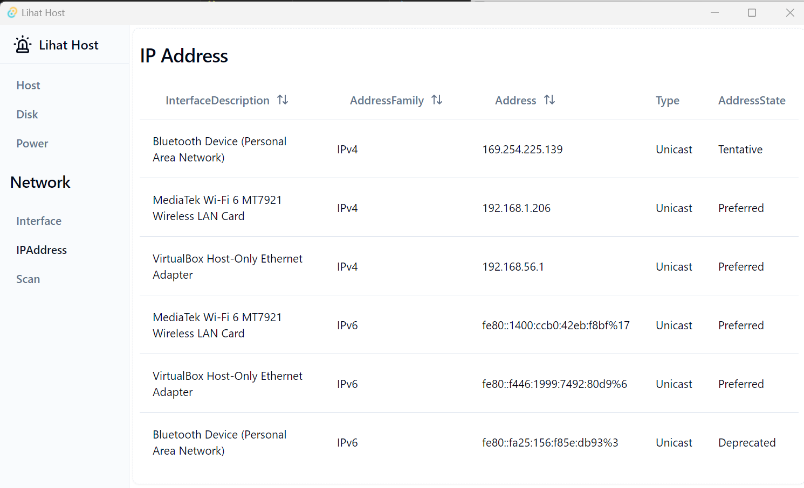
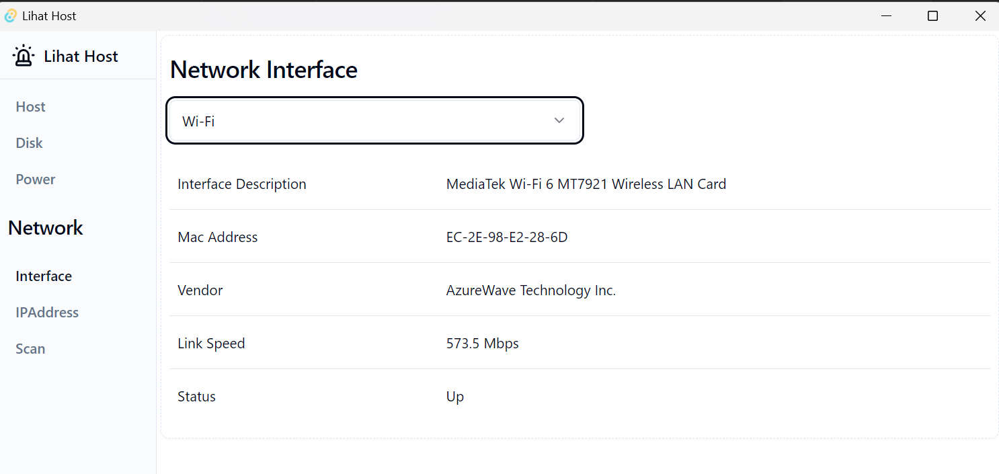
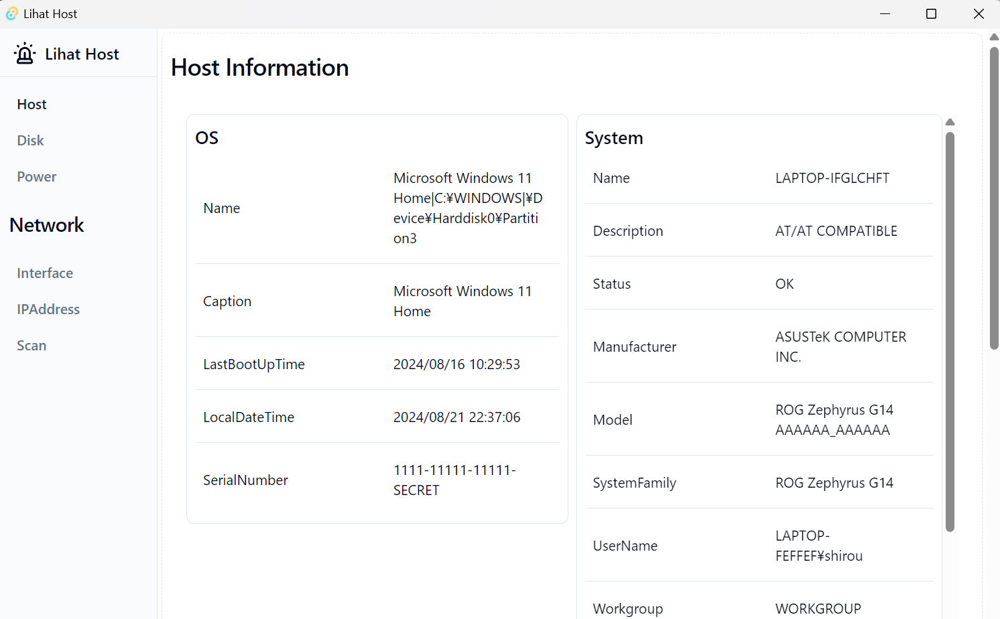

# Lihat Host

"The black screen is intimidating."

As a system administrator, you've likely heard this response many times when trying to gather information from users.

This tool is designed to retrieve detailed information about various information on Windows OS. Whether you're a system administrator, developer, or power user, this tool provides a straightforward way to gather essential data from your Windows environment. It offers insights into network configurations, hardware specifications, and more, helping you better manage and understand your devices.

# Screenshots

# Current features

- Host
    - System
    - OS
    - Processor
- Network
    - Network Interface Devices
    - IP Address

### TODO

- Disk
- Power
- Network Scan

# Architecture

This project operates using [Tauri](https://tauri.app/). On the Rust side of Tauri, specified PowerShell scripts are executed, and their results are rendered on the frontend.

# Contribute

First and foremost, thank you for considering contributing to this project. I extend my deepest gratitude to you.

This project is under a dual license. It is open-source at its core, but I seek compensation from for-profit companies that generate significant revenue. However, I do not plan to share this compensation with contributors. Instead, I will express our appreciation by adding your name to this README.

By submitting a PR, you agree to these terms.

# Contributors

# License

This project is licensed under the following licenses:

1. Apache License, Version 2.0 (LICENSE-APACHE)
2. Commercial License (LICENSE-COMMERCIAL)

This software is free for use by individuals and small organizations with fewer than 50 employees and/or less than $1 million in annual revenue.

For larger organizations, a commercial license must be obtained. Please contact https://github.com/shirou to obtain a commercial license.
